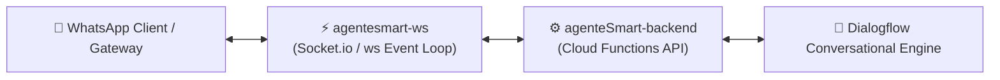

# ⚡ AgenteSmart WebSockets — Real-Time WhatsApp Bridge

A high-performance **Node.js / TypeScript WebSockets Server** engineered to provide bi-directional, real-time message tunneling between **WhatsApp messaging clients** and the **AgenteSmart** conversational backend.

Part of the **AgenteSmart Full-Stack Suite**:
- 🖥️ [**`agenteSmart-frontend`**](https://github.com/jgu7man/agenteSmart-frontend) (Visual Angular Dashboard)
- ⚙️ [**`agenteSmart-backend`**](https://github.com/jgu7man/agenteSmart-backend) (Firebase Cloud Functions & Firestore API)
- ⚡ [**`agentesmart-ws`**](https://github.com/jgu7man/agentesmart-ws) (Real-Time WebSockets WhatsApp Bridge)

---

## 🏗️ Real-Time Tunneling Architecture

---

## ✨ Features

- ⚡ **Low-Latency Event Loop:** Handles concurrent persistent WebSocket connections with minimal memory overhead.
- 🔄 **Bidirectional Event Dispatching:** Relays user inbound text/media events to backend and pushes bot responses back to WhatsApp.
- 🛡️ **Connection Heartbeats & Auto-Reconnect:** Resilient ping/pong mechanisms to prevent socket drops on mobile networks.

---

## 📄 License
Distributed under the [MIT License](LICENSE). Created by [Jorge Guzmán (@jgu7man)](https://github.com/jgu7man).
